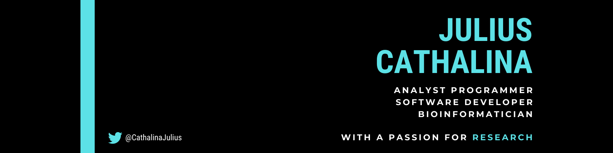

  
  
   
  
  ## 👋 Hoi! Kon ta bai?
  
  My name is Julius Cathalina, I am a Data Scientist / Software Developer based in the Netherlands!
  I am currently finishing up my Master's degree in Computer Science (Bioinformatics spec.) at Universiteit Leiden, where I also used to work as a Research Assistant.
  
   
  
  - 🌱 I’m currently learning Rust, a fantastic programming language!
  - 👯 I’m looking to collaborate on projects that focus on combining scientific code with modern software engineering principles.
  
  ## 📈 GitHub Stats

  
    
 

